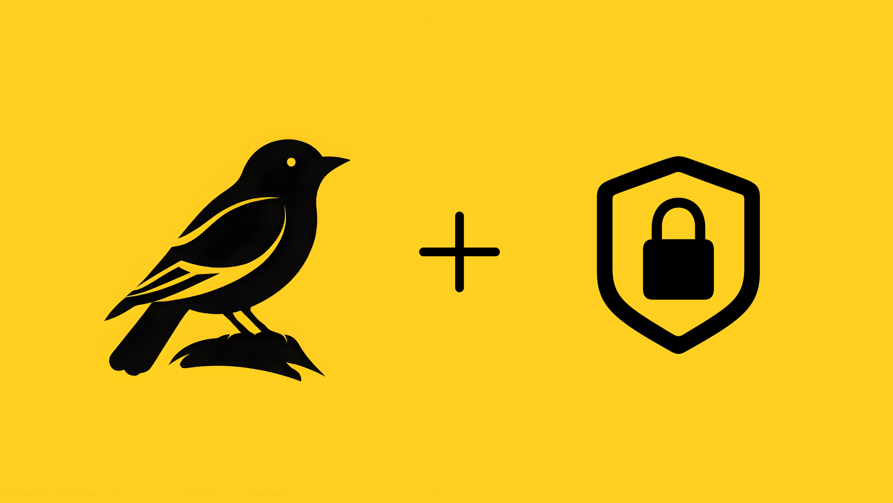

<p align="center">
  
</p>

# Chirp

Chirp is a macOS dictation app for fast, private transcription. It records from your microphone, transcribes speech locally with FluidAudio, and can copy or paste the transcript into the app you were already using.

## Features

- Local speech transcription powered by [FluidAudio](https://github.com/FluidInference/FluidAudio)
- Global keyboard shortcut recording
- Toggle and press-and-hold recording modes
- Automatic clipboard copy and optional paste into the active text field
- Microphone input selection with automatic system-default tracking
- Lightweight recording overlay with live audio levels
- Local app statistics for transcription count, word count, and recorded duration

## Privacy

Chirp is designed around local transcription. Your recorded audio is processed on your Mac instead of being sent to a transcription API.

On first use, FluidAudio may download its local speech model files. After the model is available, transcription runs locally.

## Requirements

- macOS 14.6 or newer
- Xcode with the macOS SDK
- A Mac capable of running local speech transcription models

No Apple development team is committed to the project. Xcode will sign local debug builds with "Sign to Run Locally"; contributors can choose their own signing team if they need a development or release-signed build.

## Getting Started

Clone the repository:

```sh
git clone https://github.com/TySchultz/Chirp.git
cd Chirp
```

Open the project in Xcode:

```sh
open Chirp.xcodeproj
```

Build and run the `Chirp` scheme from Xcode, or use the helper script:

```sh
./script/build_and_run.sh
```

The helper script also supports:

```sh
./script/build_and_run.sh --logs
./script/build_and_run.sh --telemetry
./script/build_and_run.sh --verify
```

## Using Chirp

1. Launch Chirp.
2. Allow microphone access when macOS asks.
3. Configure the global keyboard shortcut.
4. Choose toggle or press-and-hold recording behavior.
5. Speak, stop recording, and let Chirp transcribe locally.

To use automatic paste, macOS may require Accessibility permission so Chirp can paste into the active app.

## Project Structure

- `Chirp/` contains the macOS app source.
- `ChirpTests/` contains unit tests.
- `ChirpUITests/` contains UI test scaffolding.
- `docs/` contains recording and audio-capture research notes.
- `script/build_and_run.sh` builds, runs, and tails logs for local development.

## Dependencies

Chirp uses Swift Package Manager dependencies resolved through the Xcode project:

- [FluidAudio](https://github.com/FluidInference/FluidAudio) for local speech recognition
- [AudioKit](https://github.com/AudioKit/AudioKit) for audio utilities
- [KeyboardShortcuts](https://github.com/sindresorhus/KeyboardShortcuts) for global shortcut configuration

## Contributing

Issues and pull requests are welcome. For changes that affect recording, transcription, permissions, or signing, include the macOS version and the build command you used to verify the change.

Before opening a pull request, run:

```sh
xcodebuild -project Chirp.xcodeproj -scheme Chirp -configuration Debug -derivedDataPath .build/DerivedData build
```

## License

No license has been selected yet.
